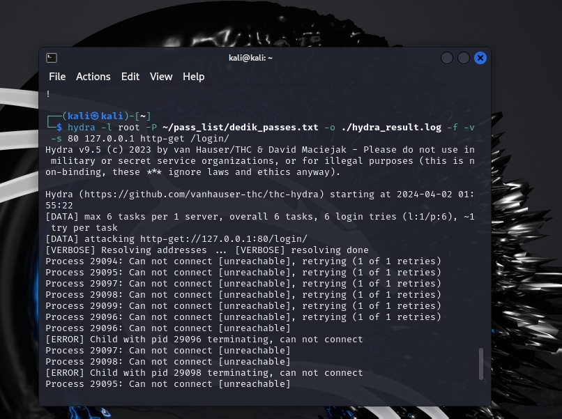

---
## Front matter
title: "Индивидуальный проект"
subtitle: "Этап 3. Использование Hydra"
author: "Хватов Максим Григорьевич"

## Generic otions
lang: ru-RU
toc-title: "Содержание"

## Bibliography
bibliography: bib/cite.bib
csl: pandoc/csl/gost-r-7-0-5-2008-numeric.csl

## Pdf output format
toc: true # Table of contents
toc-depth: 2
lof: true # List of figures
lot: true # List of tables
fontsize: 12pt
linestretch: 1.5
papersize: a4
documentclass: scrreprt
## I18n polyglossia
polyglossia-lang:
  name: russian
  options:
	- spelling=modern
	- babelshorthands=true
polyglossia-otherlangs:
  name: english
## I18n babel
babel-lang: russian
babel-otherlangs: english
## Fonts
mainfont: PT Serif
romanfont: PT Serif
sansfont: PT Sans
monofont: PT Mono
mainfontoptions: Ligatures=TeX
romanfontoptions: Ligatures=TeX
sansfontoptions: Ligatures=TeX,Scale=MatchLowercase
monofontoptions: Scale=MatchLowercase,Scale=0.9
## Biblatex
biblatex: true
biblio-style: "gost-numeric"
biblatexoptions:
  - parentracker=true
  - backend=biber
  - hyperref=auto
  - language=auto
  - autolang=other*
  - citestyle=gost-numeric
## Pandoc-crossref LaTeX customization
figureTitle: "Рис."
tableTitle: "Таблица"
listingTitle: "Листинг"
lofTitle: "Список иллюстраций"
lotTitle: "Список таблиц"
lolTitle: "Листинги"
## Misc options
indent: true
header-includes:
  - \usepackage{indentfirst}
  - \usepackage{float} # keep figures where there are in the text
  - \floatplacement{figure}{H} # keep figures where there are in the text
---

# Цель работы

Научиться использовать Hydra для взлома паролей и имени пользователя.

# Теоритическое введение

Hydra - это программное обеспечение с открытым исходным кодом для перебора паролей в реальном времени от различных онлайн сервисов, веб-приложений, FTP, SSH и других протоколов. Это распараллеленный взломщик для входа в систему, он поддерживает множество протоколов для осуществления атак. Пользователь быстро и с легкостью может добавить новые модули. Hydra предоставляет специалистам в сфере ИБ возможность узнать, насколько легко можно получить несанкционированный доступ к системе с удаленного устройства. В настоящее время этот инструмент поддерживает следующие протоколы: adam6500, afp, asterisk, cisco, cisco-enable, cvs, firebird, ftp, ftps, http[s]-{head|get|post}, http[s]-{get|post}-form, http-proxy, http-proxy-urlenum, icq, imap[s], irc, ldap2[s], ldap3[-{cram|digest}md5][s], mssql mysql(v4), mysql5, ncp, nntp, oracle, oracle-listener, oracle-sid, pcanywhere, pcnfs, pop3[s], postgres, rdp, radmin2, redis, rexec, rlogin, rpcap, rsh, rtsp, s7-300, sapr3, sip, smb, smtp[s], smtp-enum, snmp, socks5, ssh, sshkey, svn, teamspeak, telnet[s], vmauthd, vnc, xmpp. Для большинства протоколов поддерживается SSL (например, https-get, ftp-SSL и т.д.). Если это невозможно, поиск необходимых библиотек осуществляется во время компиляции, однако доступных сервисов будет меньше. Чтобы просмотреть доступные варианты, следует ввести в командную строку «hydra».


# Выполнение этапа проекта

Захожу в систему используя логин и пароль и затем захожу в консоль, ввожу команду hydra для проверки наличия установленного ПО.
Получаю сообщение о том, что всё в порядке.

{#fig:001 width=70%}

Также в начале я создал еще и директорию /pass_lists/dedik_passes.txt и вписал туда некоторые пароли для брутфорса. Первоначально эта директория не существовала, и мне выдавало соответствующую ошибку.

Ввожу команду ```hydra -l root -P ~/pass_lists/dedik_passes.txt -o ./hydra_result.log -f -V -s 80 178.72.90.181 http-post-form "/cgi-bin/luci:username=^USER^&password=^PASS^:Invalid username"```, где

- IP сервера 178.72.90.181;
- Сервис http на стандартном 80 порту;
- Для авторизации используется html форма, которая отправляет по адресу http://178.72.90.181/cgi-bin/luci методом POST запрос вида username=root&password=test_password;
- В случае не удачной аутентификации пользователь наблюдает сообщение Invalid username
- Используется http-post-form потому, что авторизация происходит по http методом post.
- После указания этого модуля идёт строка /cgi-bin/luci:username=^USER^&password=^PASS^:Invalid username, у которой через двоеточие (:) указывается:
  путь до скрипта, который обрабатывает процесс аутентификации (/cgi-bin/luci);
- строка, которая передаётся методом POST, в которой логин и пароль заменены на ^USER^ и ^PASS^ соответственно (username=^USER^&password=^PASS^);
- строка, которая присутствует на странице при неудачной аутентификации; при её отсутствии Hydra поймёт, что мы успешно вошли (Invalid username).

После выполненияэтой команды получаю ошибку, т.к сервер оказывается недоступным по какой-то причине. И как я понял нужна другая веб-форма, которой у меня нет, потому что я пробовал повторить эту команду на 127.0.0.1. 

Также пробовал сделать это и на другие сервера, но ошика выдается такая же.


{#fig:002 width=70%}

Пробую сервер 127.0.0.1/cgi-bin/luci и получаю ошибку о подключении

{#fig:003 width=70%}

Пробую сервер 127.0.0.1/login, но такж получаю ошибку, т.к. у меня нет формы на локальной машине.

{#fig:004 width=70%}


# Вывод

Т.к. команды введены верные и создан файл с возможными паролями и логинами, и команда прошла успешно, не смотря на подключение к серверу, то могу сказать, что я научился пользоваться hydra и понял как работает брутфорс через нее.